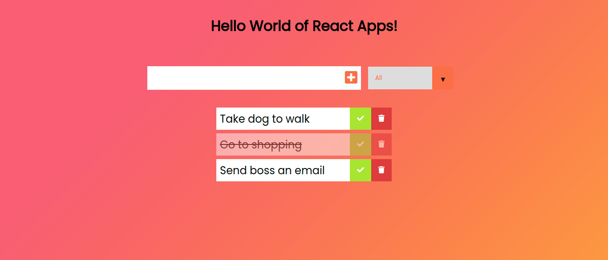

## **React Todo**

A to-do app is the "hello world" for #react beginners. So following the tradition, made one using react class components and **create-react-app**. Gotta say, intro to react has been pretty positive by far!

